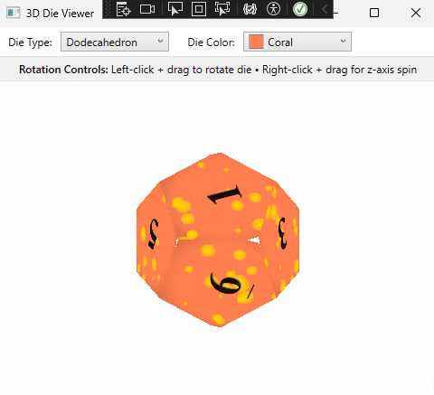

# 3D & 4D Die Viewer

A .NET 9 WPF application for visualizing and interacting with 3D and 4D polyhedral dice.

## Overview

3D & 4D Die Viewer is an interactive application that allows users to view and rotate different types of polyhedral dice in three-dimensional and four-dimensional space. The application provides realistic renderings of standard polyhedral dice (d4, d6, d8, d10, d12, d20) with customizable colors and intuitive rotation controls, plus mind-bending 4D visualizations of the pentachoron (5-cell), hexadecachoron (16-cell), and tesseract (8-cell hypercube).

## Features

- **Multiple Die Types**: Visualize all standard RPG dice:
  - Tetrahedron (d4)
  - Cube (d6)
  - Octahedron (d8)
  - Decahedron/Pentagonal Trapezohedron (d10)
  - Dodecahedron (d12)
  - Icosahedron (d20)
  - Pentachoron (5-cell, 4D simplex)
  - Hexadecachoron (16-cell, 4D cross-polytope)
  - Tesseract/Hypercube (8-cell, 4D cube)

- **Interactive 3D Rotation**: Naturally manipulate dice in 3D space:
  - Left-click + drag to rotate around X and Y axes
  - Right-click + drag to spin around the Z-axis (view direction)
  - Smart movement detection to determine rotation intent

- **Interactive 4D Rotation** (for 4D dice only):
  - Middle-click + drag to rotate around XW and YW planes
  - Shift + middle-click to rotate around ZW plane
  - Mouse wheel for additional ZW rotation
  - Ctrl + wheel for XW rotation, Shift + wheel for YW rotation

- **Customizable Appearance**: Choose from a wide variety of colors for your dice

- **Wireframe Mode**: Toggle between solid and wireframe rendering:
  - Clearly visualize the geometric structure of each die
  - See through complex shapes to understand their topology
  - Maintain full rotation functionality in both modes
  - Special 4D wireframe rendering for the tesseract with depth-based transparency

- **Realistic Rendering**: Dice include:
  - Properly positioned numbers
  - Orientation indicators (underlines) for 6 and 9 on d10, d12 and d20
  - Surface texture effects with contrast-optimized number visibility

- **Mathematically Accurate**: Proper geometric construction of all polyhedra with correct face numbering and orientation

## 4D Dice Highlights

The application features three fascinating 4D dice:

- **Tesseract (8-cell)**: The 4D hypercube with 8 cubic cells. Each cell uses a different numbering system (standard numbers, letters, Roman numerals, etc.) to help visualize the structure.

- **Pentachoron (5-cell)**: The simplest regular 4D polytope (4D simplex) with 5 tetrahedral cells. Each cell uses a different numbering system to distinguish them.

- **Hexadecachoron (16-cell)**: The 4D cross-polytope with 16 tetrahedral cells. Interestingly, each tetrahedral cell has 4 faces, but one face always points toward the interior of the shape. This means regardless of how you rotate the hexadecachoron in 4D space, you'll only ever see faces numbered 1, 2, and 3 on each cell.

## Technical Details

The application is built using:
- .NET 9
- WPF (Windows Presentation Foundation)
- 3D geometry rendering with WPF's Viewport3D
- Quaternion-based rotations for smooth interaction
- Vector math for proper 3D construction
- 4D hypercube projection into 3D space

### Architecture

- **Models**: Define the geometric structure of different dice types
- **Services**: Create textures and manage visual aspects of the dice
- **UI**: Handle user interaction and 3D visualization
- **Geometry**: Construct accurate polyhedra using precise mathematical formulations

## An Experiment in AI-Assisted Development

This project was created entirely through collaboration with GitHub Copilot, with the human developer providing only instructions and guidance. It serves two purposes:

1. **Skill Development**: To help the developer improve at writing effective GitHub Copilot prompts and understanding the collaboration process

2. **Technical Exploration**: To explore the boundaries of GitHub Copilot's capabilities in understanding and implementing 3D mathematics, geometry, and rendering techniques

> **Note**: Even this documentation was written by GitHub Copilot based on human instructions.

### Mathematical Challenges Solved

The project successfully tackled several complex mathematical problems:

- Correct generation of Platonic solid geometries
- Implementation of the d10 die (pentagonal trapezohedron), which is not a Platonic solid but is included as a standard RPG die
- Proper face-to-face relationships in polyhedra
- Quaternion-based rotation systems
- Smart movement detection algorithms
- Proper UV mapping for texture coordinates on irregular polygons

### Visualizing the Fourth Dimension

The implementation of the tesseract (4D hypercube) represents a significant achievement in visualization:

#### What is a Tesseract?
A tesseract is the 4-dimensional analog of a cube, just as a cube is the 3-dimensional analog of a square. It consists of 8 cubic cells, 24 square faces, 32 edges, and 16 vertices.

#### How the Visualization Works
- The application projects the 4D tesseract into 3D space, which we then view on a 2D screen
- Rotation in 4D space involves rotating around planes (XW, YW, ZW) rather than axes
- As the tesseract rotates in 4D, different cubic cells come into and out of our 3D "view"
- Cells are rendered with transparency based on their position in the W dimension
- Shared faces between cells display both cell's numbering systems

#### Unique Numbering Systems
Each of the 8 cubic cells uses a different numbering system:
- Cell 0: Arabic numerals (1-6)
- Cell 1: Latin alphabet (A-F)
- Cell 2: Roman numerals (I-VI)
- Cell 3: Greek letters (α-ζ)
- Cell 4: Binary numbers (bold)
- Cell 5: Hexadecimal numbers (italic)
- Cell 6: Dot patterns (like on regular dice)
- Cell 7: Circled numbers (①-⑥)

This multi-system approach makes it easier to track and understand the complex 4D relationships as the tesseract rotates.

### Challenges with the d10 Implementation

The implementation of the d10 (decahedron/pentagonal trapezohedron) highlighted interesting limitations and learning opportunities:

- While GitHub Copilot excelled at creating Platonic solids, it initially struggled with understanding kite-shaped faces and how they mesh together in a pentagonal trapezohedron
- The human developer had to explicitly teach Copilot what a kite is geometrically (a quadrilateral with two pairs of adjacent equal sides)
- Multiple iterations were required to correctly position the vertices so that:
  - The left and right vertices were positioned just above the equator
  - The bottom vertex extended just below the equator
  - The faces formed proper kites rather than triangles
  - The two halves interlocked correctly with a 36-degree offset
- Special attention was needed to ensure the numbers were properly oriented and positioned on each face
- The d10 required a custom numbering scheme where opposite faces sum to 11 (treating 0 as 10)

This demonstrated that while AI assistants like Copilot have impressive capabilities with standard geometric structures, more specialized or complex geometries may require explicit human guidance and teaching.

## How to Use

1. Select a die type from the dropdown menu
2. Choose a color for your die from the color selector
3. Toggle wireframe mode using the checkbox to switch between solid and wireframe rendering
4. Interact with the die using mouse controls:
   - For 3D dice: Left-click + drag to rotate, right-click + drag for z-axis rotation
   - For the tesseract: Also use middle-click + drag to rotate in 4D space

## Requirements

- Windows operating system
- .NET 9 runtime
- Graphics card with DirectX 10 or later support

## Future Possibilities

- Additional higher-dimensional polytopes (5D and beyond)
- Dice rolling physics simulation
- Multiple dice visualization
- Export/import customized dice
- Texture customization options
